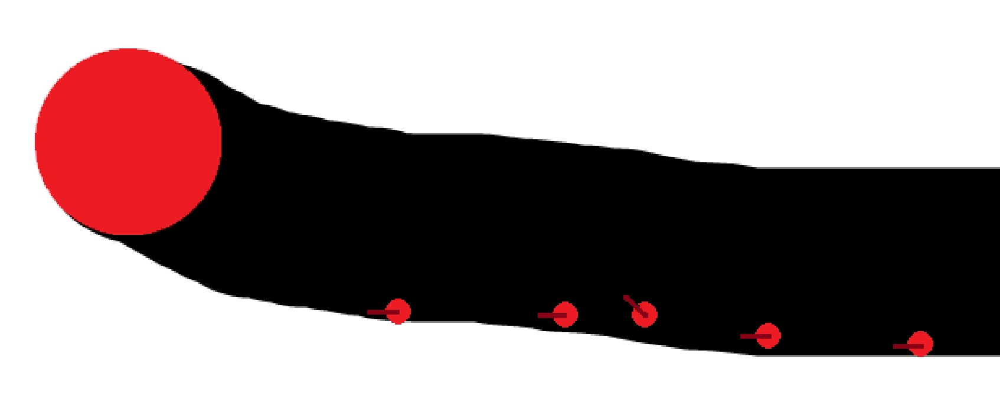

# NEAT-Based Agent Navigation with Radar Sensors


This project uses the NEAT (NeuroEvolution of Augmenting Topologies) algorithm to train agents to navigate an environment using only simulated radar sensors.

## Overview

Agents (represented as colored balls) are placed on a 2D map. Their goal is to reach certain areas while avoiding collisions and making efficient movement decisions.

They do **not** know anything about the map layout, direction, or destination. The only input they receive comes from radar sensors.

## Radar System

Each agent is equipped with multiple radar lines extending outward at different angles. These sensors detect how far obstacles are in each direction.

- The distances from radar hits are the only input to the neural network.
- Based on those values, the network outputs movement commands (like turn left, right, move forward, etc).



## Reward System

Agents receive rewards and penalties based on their actions:

- Reaching a target of the same color: **+50000**
- Touching a different valid target color: **+10000** or more depending on time/distance
- Moving: rewarded based on distance and activity
- Staying alive: small bonus per second
- Turning or moving aimlessly: penalized
- Staying in the same place for too long: leads to death
- Colliding with walls or obstacles: ends the run with a negative score

Effort is still rewarded even if the agent dies early, encouraging exploration.

## Evolution

Each generation consists of multiple agents. After every round:

- Agents with higher scores are more likely to reproduce.
- Offspring inherit traits from successful networks.
- Mutations introduce variation, allowing new strategies to evolve.

Over time, the population improves and becomes better at navigating.

## Visualizations

- **Video**: `Generations.mp4`
- **Radar Snapshot**: `Radius.png`
- **Fitness Graph**: `NeatFitnessOverGenerations.png`


## NEAT Configuration

Basic configuration (in `config-feedforward.txt`):

```ini
[NEAT]
fitness_criterion     = max
fitness_threshold     = 100000000
pop_size              = 30
reset_on_extinction   = True

[DefaultGenome]
activation_default      = tanh
aggregation_default     = sum
bias_mutate_rate        = 0.7
conn_add_prob           = 0.5
node_add_prob           = 0.2
feed_forward            = True
initial_connection      = full
num_inputs              = 7
num_outputs             = 4
weight_mutate_rate      = 0.8

More settings are available in the full file.
```
## How to Run

### Install dependencies:

```ini
pip install pygame neat-python
```
Run the simulation:
```ini
python main.py
```
Your environment should include a 2D map with a black background and white borders.
